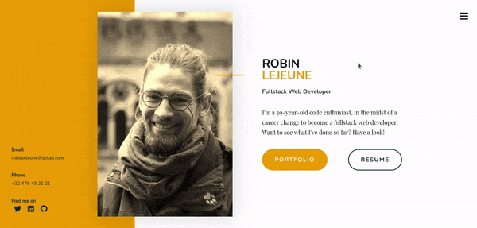

# V-Card

From a template, let's recreate a one-page website to showcase my work and have a virtual business card.

## Branches

1. Layout

    Layout using flexbox. Works alright but not responsive-friendly.

2. Grid

    Layout using grid (*who would have guessed?*), fully responsive.

## Responsiveness

**Desktop** | **Medium sizes** | **Smartphone**
:---: | :---: | :---:
 |  | 